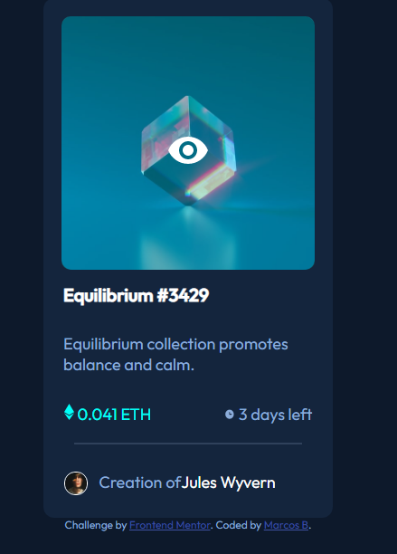

# Frontend Mentor - NFT preview card component solution

This is a solution to the [NFT preview card component challenge on Frontend Mentor](https://www.frontendmentor.io/challenges/nft-preview-card-component-SbdUL_w0U). Frontend Mentor challenges help you improve your coding skills by building realistic projects. 

## Table of contents

- [Overview](#overview)
  - [The challenge](#the-challenge)
  - [Screenshot](#screenshot)
  - [Links](#links)
- [My process](#my-process)
  - [Built with](#built-with)
  - [What I learned](#what-i-learned)
  - [Continued development](#continued-development)
  - [Useful resources](#useful-resources)
- [Author](#author)


## Overview

### The challenge

Users should be able to:

- View the optimal layout depending on their device's screen size
- See hover states for interactive elements

### Screenshot




### Links

- Solution URL: [Add solution URL here](https://your-solution-url.com)
- Live Site URL: (https://nft-previewcard-dusky.vercel.app/)

## My process
I starte adding some flex to center everything, after that, some width and height to the card itself, some background color to fit the challenge, making a "root" table  for the colors and then the real challenge begun i started to struggle centering the texts, starting to go a trial and error aproach, step by step to center everything, sometimes when i moved something, something else move so it was chaotic in the start, after a some diggin and researching, got some tips here and there in the web to center, using flex in some place, inline methods.

And the overlay was a real challenge got some info about, text on overlays, boxes, but the image/icon thing was hard, then i applied some of the methods found changing a few things and finally worked out.

It's kinda rough and hard the css itself probabbly could do the same in a tons of fewer lines, but i am quite proud of myself doing it. 

but still looking for improvement and orientation to make it better

### Built with

- Semantic HTML5 markup
- CSS custom properties
- CSS flex


### What I learned

Use this section to recap over some of your major learnings while working through this project. Writing these out and providing code samples of areas you want to highlight is a great way to reinforce your own knowledge.

To see how you can add code snippets, see below:


```css
.img-cont {
    position: relative;
      
}
.overlay {
    position: absolute;
    top: 0;
    bottom: 0;
    left: 0;
    right: 0;
    height: 95%;
    width:100%;
    opacity: 0;
    background-color: var(--cyan);
    border-radius: 10px;
  }
  
  .view {
    position: absolute;
    width: auto;
    height: auto;
    top: 50%;
    left: 50%;
    transform: translate(-50%, -50%);
    text-align: center;
    display: none;
  }
  
  .img-cont:hover .overlay {
    opacity: 0.3;
    cursor: pointer;
  }
  
  .img-cont:hover .overlay + .view {
    display: block;
  }
```


### Continued development

Well until now i have picked, simple projects just to sharp my fundamentals, but i am still quite rough on the edges, so I will try to do as much projects untill i got really used to centering some objects with flex and grid, position on objects etc.


### Useful resources

- Make an Overlay over an image(https://stackoverflow.com/questions/21086385/how-to-make-in-css-an-overlay-over-an-image) - I was lost until i found this  pretty simple but concise
- (https://www.w3schools.com/css/css_combinators.asp) - This one helped me learning about some combinators i haven't see until then


## Author

- Frontend Mentor - [@ToxGem](https://www.frontendmentor.io/profile/yourusername)
)


